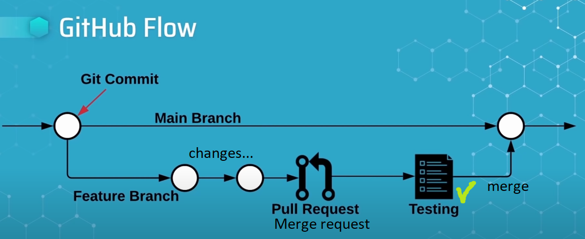
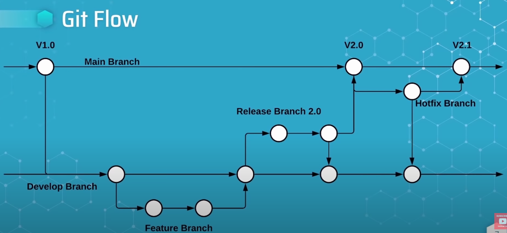
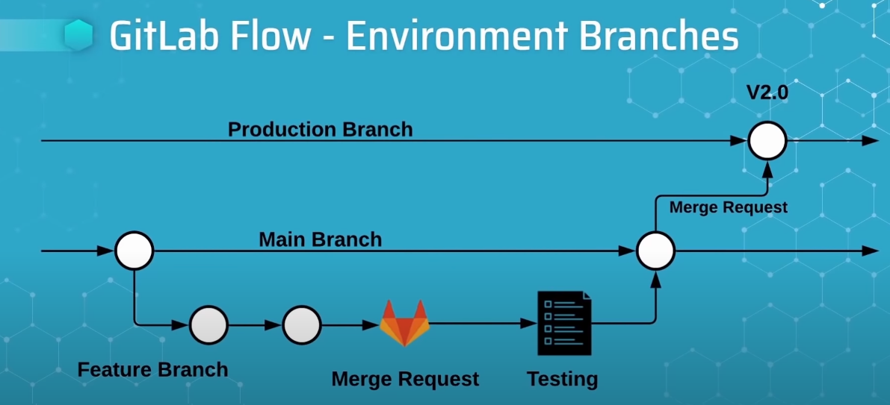
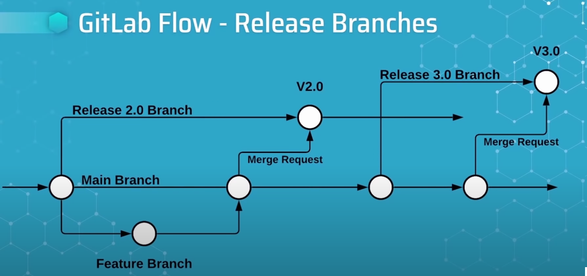

# Gitlab
- Gitlab is Open-Source SW development platform
- Source code management system
- CI/CD platform for devops/any developer really
  
  # Key GitLab Terms
  ### Group
  - Allows you to manage settings across multipl projects
  - Logical categorizations of multiple users or project
  - Provides cross-project view of things like __issues__ and __merge requests__
  ### Project
  - Container for Git repository
  - Has built in CI/CD
  - Has __Issue Tracking__
  ### Member
  - Users or groups that have access to a project
  - Members are assigned roles
  - Member roles iunclude permission to perform actions on projects or groups
  ### Merge Request
  - A request to merge one branch into another
  - Merge Request __provide a space__ to have a conversation with the team about the changes on a branch
  - It is the central place through which changes are reviewed and verified
  ### Issue
  - is a way to track work related to a GitLab project
  - can be used to report bugs track tasks,request new features, ask questions and more
  - your development workflow should begin with an issue

 ## Gitlab CI
 ## Gitlab Flow
 ### Branching strategy
 - A SW development workflow within the context of git
 - describes how a development team will create, collaborate on, and merge branches of source code in a codebase
 - enables concurrent development in the codebase
 - how to choose one? - depends on
   - Team requirments
   - Source code management system
   - application environments
### Branching strategies
  - Github flow
      
    -  simplest workflow of the three
    -  __pull request = merge request__
  - Git flow
  
    - most complex of the three
  - Gitlab flow
    - midway complexity
    - has 2 variations
    - Gitlab flow - Environment Branches
  
      - yes
     - Gitlab flow - Release Branches
  
        - open source projects
  
