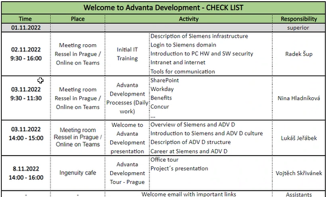

# Important Notes 11.2.2022

 - 2 tools fro init training
    - siemens.edunio.com
    - siemens-learning.sabacloud.com - mylearning
 - i will get a backpack or bag
 - smartohone - samsung galaxy something - T-mobile 60kč/month(for personal use) - possible phone number migration after probation period

## Something more practical
 - __RicohLocalSecurePrint__ - siemens secure print options in __Printer & scanners__ windows option
 - __greenshot__ - screenshot tool
 - __conpal Lan crypt__ - conpal LAN Crypt is a client-side encryption solution that provides file-level encryption on all major endpoint platforms, including mobile devices.
 - __PKI basic client__ - for login to simenes
 - __Zscaler__ - VPN tunnel app
 - __one drive__ - backups 
 - __ADV Client FAQ__ - https://siemens.sharepoint.com/teams/EmployeeManual/SitePages/ADVANTA-Client-installation.aspx
 - __Cloud Optimized Internet Access__ - thats why I have everything in german xd
 - __KeePass__ - password storage
 - __PDF-Xchange Standar pdfSaver__ - pdf editor
 - __evosoft__ - advanta hungary - information about device - 14days admin rights?
 - __software center__ - limited sw installer - restricted microsoft store
    - software scans - licences reason - reporting which sw is installed
    - do not install games 
    - do not test SW for personal use
- __samtools__ - https://samtools.siemens.com/Web-Toolbox/modul_MLC/MLC_CentralManagedSoftware.aspx - list of sw available - if something is not in __software center__
    - download only SW with free commercial use
- __Local admin rights for client(my pc)__ - https://support.evosoft.com/otrs/customer.pl?Action=CustomerTicketProcess
    - bios has password
- __mysignins.microsoft.com__
- __hello.siemens.com__ - lot of tool - __docházka__ - insert manually when home office - __close it on the end of the month__
mMobile - https://siemens.sharepoint.com/teams/mMobile

